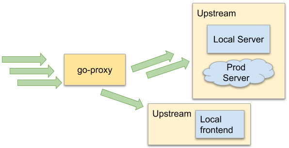

# go-proxy

[](https://github.com/visola/go-proxy/releases/latest)
[](https://travis-ci.com/visola/go-proxy)
[](https://goreportcard.com/report/github.com/visola/go-proxy)
[](https://codeclimate.com/github/visola/go-proxy/maintainability)

go-proxy is a server that helps developers work faster in the world of microservices and microfrontends. You run it locally to serve all local traffic from multiple sources into one place, acting as a gateway.

<p style="text-align:center">
  
</p>

This is what it can do for you:

- serve static files from disk
- reverse proxy other http/s servers
- it has an admin UI (and API) that can be used to quickly switch upstreams
- multiple listeners in different ports that can act as different servers

# Getting Started

1. Download the latest release for your system [here](https://github.com/visola/go-proxy/releases/latest)
2. Unzip it and make the executable available in your path
3. Create a `~/.go-proxy` directory and add some mapping files
4. Run `go-proxy`

You should see something like the following:

```
$ go-proxy
2019/12/31 13:08:59 Initializing go-proxy...
2019/12/31 13:08:59 Initializing upstreams...
2019/12/31 13:08:59 Opening admin server at: http://localhost:3000
2019/12/31 13:08:59 Reading configuration directory: /Users/visola/.go-proxy
2019/12/31 13:08:59 Starting proxy at: http://localhost:33080
2019/12/31 13:08:59 Found 4 upstreams in file: /Users/visola/.go-proxy/search.yml
```

# Endpoints and Upstreams

Endpoints are where requests end up being handled. They represent files on your disk or servers running locally or somewhere else. There are two types of endpoints: static and proxy. Static endpoints serve static files from disk. Proxy endpoints forward requests to HTTP/S servers.

Endpoints are grouped inside Upstreams. Each upstream can have multiple endpoints configured. Upstreams are mapped in YAML files inside the `~/.go-proxy/` directory. Each file in the `~/.go-proxy` directory becomes an upstream named after the file. It can contain both types of endpoints. The following is a YAML file that contains a static and a proxy endpoints:

```yaml
# ~/.go-proxy/search.yml
static:
  - from: /static
    to: /Users/visola/www

proxy:
  - from: /
    to: https://www.server.com
```

## Matching

Endpoints match request paths using a from or a regexp definition. 

The from matches any path requested that starts with the specified path. Example, `from: /static` matches all of the following:

```
/static/index.html
/static/sub/main.js
/static/sub1/sub2/sub3/sub4/sub.js
```

Endpoints can also match using regular expressions. For example, `regexp: /static/js(.*\.chunk\.js)` matches all of the following:

```
/static/js.chunk.js
/static/js12abec3.chunk.js
/static/js/subchunk/12abec3.chunk.js
```

## Static Endpoints

Static endpoints serve files from a local directory. The following static endpoint configuration:

```yaml
static:
  - from: /static
    to: /Users/visola/www
```

would match a request coming to `/static/index.html` to `/Users/visola/www/index.html`. It also servers files in any subdirectory, e.g. `/static/js/main.js` would serve `/Users/visola/www/js/main.js`.

## Proxy endpoints

Proxy endpoints forward requests to another HTTP/S server and sends the response back as a normal proxy does. The following proxy endpoint:

```yaml
proxy:
  - from: /
    to: https://www.server.com
```

would match requests coming to `/index.html` to `https://www.server.com/index.html`. It also matches any subpath like `/images/questionmark.png` to `https://www.server.com/images/questionmark.png`.

# Listeners

go-proxy uses listeners to handle requests. Each listener listens to requests incoming in a specific port, using HTTP or HTTPS.

Listeners can have different upstreams enabled to handle requests. If no upstreams are enabled, a listener will always return a 404.

<!-- TODO - Explain how to configure listeners -->

## Specificity

<!-- TODO - Explain sorting by specificity -->

# Building go-proxy

## Pre-requisites

Before anything, you'll need:
- Go >1.13
- Node.js >8.7.0

## Building locally

Just run the build bash script:

```
$ ./scrtips/build.sh
```

This will run the tests, install all the dependencies and build the frontend using Webpack.

If that worked, you can run the package script to generate the package for all plataforms:

```
$ ./scripts/package.sh
```

The output will be in the `build/packages` directory.

## Local development

To serve the static files, `go-proxy` uses `packr`, which can point to local files or pack everything inside the final Go binary.

You need to make sure that you have [packr](https://github.com/gobuffalo/packr) installed and available on your path. Normally the following command should do it:

```
$ go get -u github.com/gobuffalo/packr/v2/packr2
```

Run the following command to ensure that `packr` binary files do not exist:

```
$ packr clean
```

No you can start Webpack to watch the admin frontend with the following:

```
$ cd web
$ npm run start
```

The above will block, so you might want to run it from a separated console.

Now you can change the files and rerun like you would any other go application:

```
$ go run cmd/go-proxy/main.go 
```
